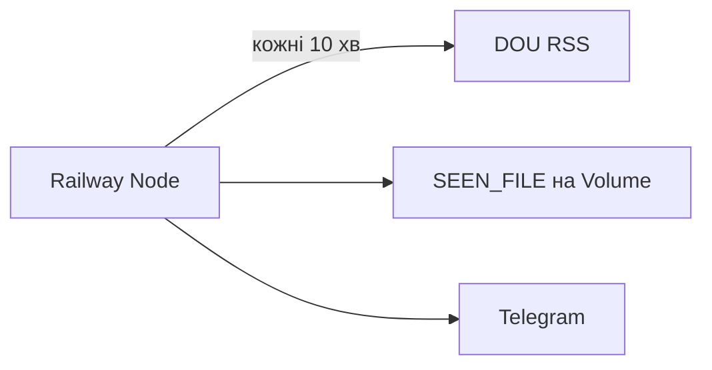

# DOU Вакансії Tracker

Node-сервіс на [Railway](https://railway.app): за розкладом качає RSS вакансій з [DOU](https://jobs.dou.ua) (за замовчуванням пошук React, кожні 10 хвилин), пам’ятає вже бачені id у файлі на Volume і шле нові в Telegram.

Без Cloudflare Workers / GitHub Actions — DOU не блокує звичайні IP Railway.

## Як це працює

1. Процес стартує, слухає `PORT` (health + ручний `/run`).
2. Одразу робить першу перевірку, далі `setInterval` кожні `CHECK_INTERVAL_MINUTES` (за замовчуванням 10).
3. Тягне `https://jobs.dou.ua/vacancies/feeds/?search=<DOU_SEARCH>&descr=1`.
4. Якщо `ONLY_TODAY=true` (за замовчуванням), лишає вакансії за сьогодні (`Europe/Kyiv`).
5. Нова = id ще немає в `SEEN_FILE`.
6. Запис спочатку має стан `pending`. Після успішного Telegram він стає `sent`. Якщо відправка впала, запис лишається `pending` і повторюється на наступному тіку, максимум 5 спроб. `MAX_SEEN` витісняє лише `sent`.



## Структура

```
src/
  server.ts      # HTTP + setInterval
  check.ts       # оркестрація
  parser.ts      # DOU RSS + cheerio
  telegram.ts    # Telegram Bot API
  storage.ts     # seen_vacancies.json
  loadEnv.ts     # process.env
scripts/
  check-once.ts  # npm run check / check:dry
```

## Локально

```bash
npm install
cp .env.example .env
```

Заповніть `TELEGRAM_BOT_TOKEN`, `TELEGRAM_CHAT_ID`, `MANUAL_TRIGGER_SECRET`. За потреби змініть `DOU_SEARCH`, `ONLY_TODAY`, `CHECK_INTERVAL_MINUTES`, `MAX_SEEN` (див. `.env.example`).

```bash
npm test              # парсер, HTML і повтор відправки
npm run get-chat-id   # після /start боту в Telegram
npm run check:dry     # DOU → parser → console; без Telegram і без запису seen
npm run check         # повний flow
npm start             # сервер + інтервал
```

Ручний запуск при працюючому сервері:

```bash
curl "http://localhost:3000/run?secret=YOUR_MANUAL_TRIGGER_SECRET"
curl "http://localhost:3000/run?secret=YOUR_MANUAL_TRIGGER_SECRET&dry=1"
```

## Деплой на Railway

1. [railway.app](https://railway.app) → New Project → Deploy from GitHub → репо `vacancies`.
2. Variables:

   - `TELEGRAM_BOT_TOKEN`
   - `TELEGRAM_CHAT_ID`
   - `MANUAL_TRIGGER_SECRET`
   - `SEEN_FILE=/data/seen_vacancies.json`
   - за потреби: `DOU_SEARCH`, `ONLY_TODAY`, `CHECK_INTERVAL_MINUTES`, `MAX_SEEN`

3. Volume: mount path `/data` (щоб seen не губився після редеплою).
4. Settings → Start Command: `npm start` (або залиште дефолт з `package.json`).
5. Deploy → у логах має бути перша перевірка і `Listening on :$PORT`.

Ручний прод-чек:

```bash
curl "https://YOUR-RAILWAY-DOMAIN/run?secret=YOUR_MANUAL_TRIGGER_SECRET&dry=1"
```

## Вимкнути старий Cloudflare Worker

Щоб не було дублів у Telegram:

1. Cloudflare Dashboard → Workers → `dou-vacancy-tracker` → Triggers → видаліть Cron `*/10 * * * *` **або** видаліть Worker.
2. GitHub → Actions: workflow `Fetch DOU RSS` уже прибрано з репо.

## Налаштування

Усе керується змінними середовища (значення за замовчуванням у дужках):

- `DOU_SEARCH` (`React`) — пошуковий запит RSS.
- `ONLY_TODAY` (`true`) — слати лише вакансії за сьогодні в `Europe/Kyiv`. `false` шле будь-яку ще не бачену вакансію з фіду, тож після простою через північ нічого не губиться.
- `CHECK_INTERVAL_MINUTES` (`10`) — пауза між перевірками.
- `MAX_SEEN` (`100`) — скільки успішно відправлених вакансій пам’ятати. Записи `pending` цей ліміт не витісняє.
- `SEEN_FILE` (`./seen_vacancies.json`) — шлях до стану. Запис іде у тимчасовий файл і потім `rename`, щоб обрив не залишив битий JSON. Якщо файл не читається, тік пропускається і файл не затирається.

`GET /` показує `lastSuccessAt`, `lastError`, `seenCount`, `pendingCount`. Секретів у відповіді немає.

## Ліцензія

MIT
