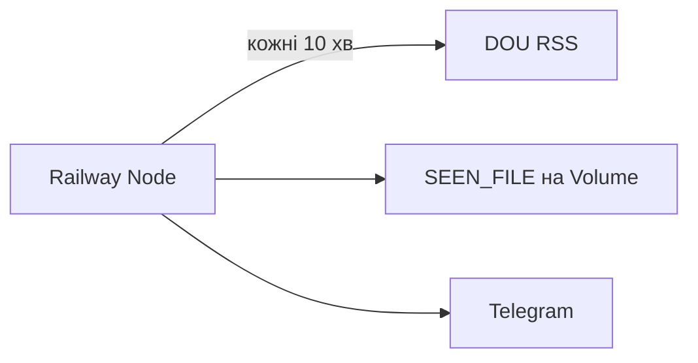

# DOU Вакансії Tracker

Node-сервіс на [Railway](https://railway.app): кожні **10 хвилин** качає RSS React-вакансій з [DOU](https://jobs.dou.ua), пам’ятає вже бачені id у файлі на Volume і шле нові в Telegram.

Без Cloudflare Workers / GitHub Actions — DOU не блокує звичайні IP Railway.

## Як це працює

1. Процес стартує, слухає `PORT` (health + ручний `/run`).
2. Одразу робить першу перевірку, далі `setInterval` кожні 10 хв.
3. Тягне `https://jobs.dou.ua/vacancies/feeds/?search=React&descr=1`.
4. Фільтр: тільки вакансії за сьогодні (`Europe/Kyiv`).
5. Нова = id ще немає в `SEEN_FILE` (останні 100).
6. Id пишеться **до** Telegram, щоб retry не дублював повідомлення.



## Структура

```
src/
  server.ts      # HTTP + setInterval
  check.ts       # оркестрація
  parser.ts      # DOU RSS + cheerio
  telegram.ts    # Telegram Bot API
  storage.ts     # seen_vacancies.json
  loadEnv.ts     # process.env
scripts/
  check-once.ts  # npm run check / check:dry
```

## Локально

```bash
npm install
cp .env.example .env
```

Заповніть `TELEGRAM_BOT_TOKEN`, `TELEGRAM_CHAT_ID`, `MANUAL_TRIGGER_SECRET`.

```bash
npm run get-chat-id   # після /start боту в Telegram
npm run check:dry     # DOU → parser → console; без Telegram і без запису seen
npm run check         # повний flow
npm start             # сервер + інтервал 10 хв
```

Ручний запуск при працюючому сервері:

```bash
curl "http://localhost:3000/run?secret=YOUR_MANUAL_TRIGGER_SECRET"
curl "http://localhost:3000/run?secret=YOUR_MANUAL_TRIGGER_SECRET&dry=1"
```

## Деплой на Railway

1. [railway.app](https://railway.app) → New Project → Deploy from GitHub → репо `vacancies`.
2. Variables:

   - `TELEGRAM_BOT_TOKEN`
   - `TELEGRAM_CHAT_ID`
   - `MANUAL_TRIGGER_SECRET`
   - `SEEN_FILE=/data/seen_vacancies.json`

3. Volume: mount path `/data` (щоб seen не губився після редеплою).
4. Settings → Start Command: `npm start` (або залиште дефолт з `package.json`).
5. Deploy → у логах має бути перша перевірка і `Listening on :$PORT`.

Ручний прод-чек:

```bash
curl "https://YOUR-RAILWAY-DOMAIN/run?secret=YOUR_MANUAL_TRIGGER_SECRET&dry=1"
```

## Вимкнути старий Cloudflare Worker

Щоб не було дублів у Telegram:

1. Cloudflare Dashboard → Workers → `dou-vacancy-tracker` → Triggers → видаліть Cron `*/10 * * * *` **або** видаліть Worker.
2. GitHub → Actions: workflow `Fetch DOU RSS` уже прибрано з репо.

## Налаштування

Пошук і фільтр «сьогодні» — у `src/parser.ts` (`DOU_URL`, `ONLY_TODAY`). Ліміт seen — `MAX_SEEN = 100` у `src/storage.ts`. Інтервал — `CHECK_INTERVAL_MS` у `src/server.ts`.

## Ліцензія

MIT
